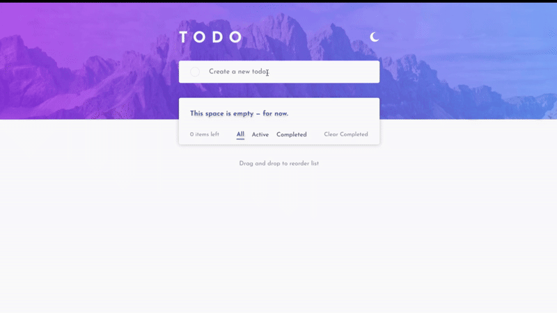

# Todo App (English Version)

A **responsive Todo App** built with **TypeScript**, **SCSS**, and **HTML5**.  
This app allows users to manage their daily tasks efficiently, switch between light and dark themes, and filter or drag tasks easily.

> 💡 This project is my personal solution to the [Frontend Mentor Todo App Challenge](https://www.frontendmentor.io/challenges/todo-app-Su1_KokOW).

---

## 👀 Preview

---

## 🚀 Live Demo
👉 [Check it out in action](https://gamalhafez.github.io/todo-app-english-version/)

---

## 🛠️ Built With

- **TypeScript** – For type safety and cleaner code.
- **Vite** – For fast development and optimized builds.
- **SCSS (Sass)** – For organized, modular styling.
- **LocalStorage API** – To persist tasks and theme preferences.

---

## ✨ Features

- ➕ Add new tasks  
- ❌ Delete individual tasks  
- ✅ Mark tasks as completed  
- 🔍 Filter by “All / Active / Completed”  
- 🌙 Toggle between Light & Dark themes  
- 🧩 Drag & Drop to reorder tasks  
- 🗑️ Clear all completed tasks  
- 💾 Auto-save tasks using Local Storage  
- ⚙️ Error handling for empty or duplicate tasks

---
